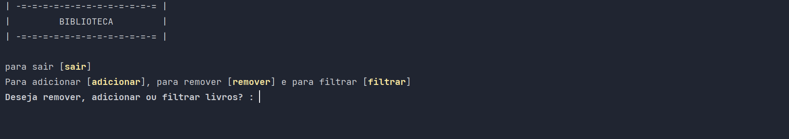

# 📚 Projeto Biblioteca 🐍

"Um acervo organizado com a força da programação."

📖 Sobre o projeto

Este projeto foi desenvolvido durante meus estudos em Python, com o objetivo de treinar e aprofundar os conhecimentos em programação estruturada e manipulação de dados.

O Projeto Biblioteca consiste em um sistema simples que permite ao usuário:

Adicionar livros ao acervo

Remover livros da coleção

Filtrar livros de acordo com critérios definidos

---

🛠️ Tecnologias utilizadas

Python 3

---

🎯 Objetivos de aprendizagem

Praticar conceitos básicos de Python

Implementar operações de CRUD (Create, Read, Update, Delete) em listas/dicionários

Desenvolver lógica para filtragem de dados

Estruturar um sistema simples mas funcional

---

✨ Funcionalidades

➕ Adicionar livros ao acervo

➖ Remover livros cadastrados

🔍 Filtrar livros por critérios específicos

📑 Visualizar toda a coleção registrada

  

